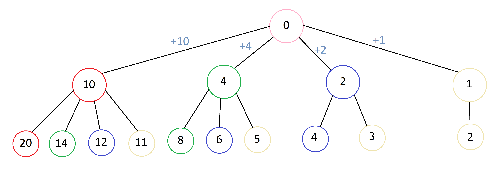

 

# Грандиозная задача для третьего класса :sleepy:

**Формулировка:** Требуется найти количество способов разменять купюру в 1000 рублей купюрами по 50, 100, 200 и 500 рублей.

# Объяснение решения

Для решения данной задачи была использована древовидная структура. 
Для начала, стоит заметить, что для того, чтобы убедиться в уникальности найденных решений, мы будем рекурсивно перебирать "купюры" в порядке невозрастания. Именно поэтому дерево для решения будет выглядеть примерно таким образом:

В процессе перебора возможных комбинаций будем вести учет тех, которые нас устраивают (сумма номиналов которых равна 1000). Если мы зайдем за пределы тысячи, останавливаем перебор в данной ветви.
> Если нам нужно найти комбинации для суммы больше 1000, то мы можем поменять это значение в поле `money`

## Отдельное спасибо
 [Пятнадцати моим братьям](https://github.com/juseppee) - за предоставленную задачу
 
 [Маме](https://vk.com/alfira233) вышеуказанных братьев - за помощь в решении
 
 Сестре - за фарш
 
